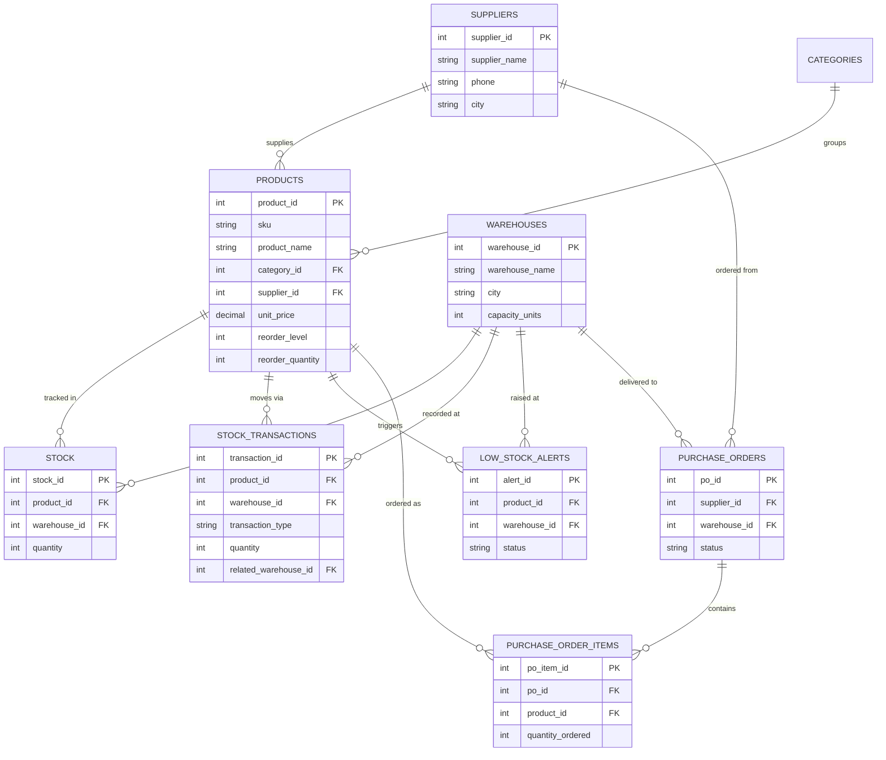

<div align="center">


<p align="center">
  
  
  
  
</p>

</div>


## 🎯 What This Project Actually Does

> Most "inventory system" student projects are just a `products` table with a `quantity` column that the app updates directly. StockSync does it the way a real warehouse system has to: **stock is never updated directly.** Every stock change — a sale, a delivery, a transfer between warehouses — is written as an immutable row in `stock_transactions`. A trigger then syncs the live `stock` balance automatically, and a second trigger watches for low-stock thresholds and opens reorder alerts on its own. The database enforces the business rules; the application layer can't bypass them even if it tries.

That single design decision is what makes this worth explaining in an interview: it demonstrates **triggers, transactions, referential integrity, and audit-trail design** in one coherent system, not five disconnected SQL scripts.


## 🧩 Entity-Relationship Diagram




## 🗂️ Schema Overview

| Table | Purpose |
|---|---|
| `suppliers` | Vendor master data |
| `categories` | Product grouping |
| `warehouses` | Physical storage locations + capacity |
| `products` | SKU master, price, reorder thresholds |
| `stock` | **Current** quantity per product per warehouse (maintained by trigger, never written to directly) |
| `stock_transactions` | **Source of truth** — every IN / OUT / TRANSFER as an immutable log row |
| `low_stock_alerts` | Auto-opened (and auto-resolved) by trigger |
| `purchase_orders` / `purchase_order_items` | Reorder workflow with suppliers |


## ⚡ Triggers — Tested Live, Not Just Written

<table>
<tr><th>Trigger</th><th>Fires On</th><th>What it does</th></tr>
<tr><td><code>trg_after_insert_transaction</code></td><td>AFTER INSERT on <code>stock_transactions</code></td><td>Recalculates the live balance in <code>stock</code> — the app never touches <code>stock</code> directly</td></tr>
<tr><td><code>trg_prevent_negative_stock</code></td><td>BEFORE UPDATE on <code>stock</code></td><td>Blocks any update that would push quantity below zero, via <code>SIGNAL SQLSTATE</code></td></tr>
<tr><td><code>trg_low_stock_alert</code></td><td>AFTER UPDATE on <code>stock</code></td><td>Opens an alert when quantity drops to/below reorder level; auto-resolves it once restocked</td></tr>
<tr><td><code>trg_low_stock_alert_on_insert</code></td><td>AFTER INSERT on <code>stock</code></td><td>Same check for the very first stock row of a new product/warehouse pair</td></tr>
</table>

**Verified test run** — issuing 9,999 units against a product that only has 7 in stock:

```sql
mysql> CALL sp_issue_stock(3, 1, 9999, 'should fail');
ERROR 1644 (45000): Stock quantity cannot go below zero for this product/warehouse.
```

The original `INSERT` into `stock_transactions` rolled back completely — no orphaned audit row, no partial update. That's the trigger chain (insert → sync trigger → guard trigger) protecting data integrity end-to-end, confirmed by re-querying `stock_transactions` and finding zero matching rows afterward.


## 🔧 Stored Procedures

| Procedure | What it does |
|---|---|
| `sp_transfer_stock(product, from_wh, to_wh, qty)` | Transactional inter-warehouse transfer; rolls back entirely if source has insufficient stock |
| `sp_receive_stock(product, warehouse, qty, note)` | Records an inbound delivery |
| `sp_issue_stock(product, warehouse, qty, note)` | Records an outbound dispatch (sale/internal use) |
| `sp_reorder_report()` | Every product at/below reorder level, ranked by severity, with supplier contact |
| `sp_create_purchase_order(supplier, warehouse, product, qty, cost, lead_days)` | Multi-table transactional PO creation (header + line item) |

**Verified test run** — transferring 20 units of Ballpoint Pen Boxes from Bengaluru to Chennai:

```sql
mysql> CALL sp_transfer_stock(9, 2, 1, 20);
+--------------------------------------------------------------------+
| result                                                              |
+--------------------------------------------------------------------+
| Transferred 20 unit(s) of product #9 from warehouse #2 to warehouse #1 |
+--------------------------------------------------------------------+
```
Bengaluru went `130 → 110`, Chennai went `18 → 38` — confirmed by re-querying `stock` immediately after.


## 📊 Reporting Output (real data from this repo's seed set)

**Reorder report** (`CALL sp_reorder_report();`) — 12 of 45 stock rows currently need attention:

| SKU | Product | Warehouse | Qty | Reorder Level | Supplier |
|---|---|---|---|---|---|
| OFF-3002 | Ballpoint Pen Box | Chennai | 18 | 60 | Apex Office Essentials |
| ELE-1004 | Power Bank 10000mAh | Mumbai | 8 | 20 | Crescent Electronics |
| ELE-1003 | Bluetooth Speaker Mini | Chennai | 7 | 15 | BrightTech Distributors |
| ELE-1002 | Wireless Mouse 2.4GHz | Bengaluru | 14 | 25 | BrightTech Distributors |

**Warehouse KPI view** (`SELECT * FROM vw_warehouse_summary;`):

| Warehouse | SKUs | Units | Stock Value (₹) | Capacity Used |
|---|---|---|---|---|
| Chennai Central | 15 | 1,762 | 5,67,888 | 11.7% |
| Bengaluru Tech Park | 15 | 928 | 3,00,942 | 7.7% |
| Mumbai Distribution | 15 | 1,043 | 3,82,857 | 5.8% |

**Total company-wide inventory value:** ₹12,51,687 across 15 SKUs / 3,733 units on hand.

<details>
<summary>📋 <strong>See all 10 queries in <code>06_queries.sql</code> (click to expand)</strong></summary>

1. Current stock level + status per product/warehouse
2. Open reorder alerts with supplier contact
3. Warehouse-level KPI summary
4. Total company-wide inventory value
5. Top 5 fastest-moving products (last 30 days)
6. Dead-stock detector (zero outbound movement, stock still on hand)
7. Supplier scorecard (SKUs supplied + value held)
8. Monthly IN vs OUT transaction volume trend
9. Pending purchase orders with days-remaining countdown
10. Stock value ranked within category using `RANK() OVER (PARTITION BY ...)`

</details>


## 🛠️ How to Run This in DBeaver

1. **Install MySQL** (or use any reachable MySQL 8 / MariaDB 10.2+ server) and connect to it in DBeaver via *Database → New Database Connection → MySQL*.
2. Open a **SQL Editor** against your connection.
3. Run the files **in this exact order**:
   ```
   sql/01_schema.sql        -- creates the database + all tables
   sql/02_sample_data.sql   -- realistic seed data (15 products, 3 warehouses, 5 suppliers)
   sql/03_triggers.sql      -- the auto-sync + alerting logic
   sql/04_procedures.sql    -- transfer / receive / issue / reorder / PO procedures
   sql/05_views.sql         -- dashboard views
   sql/06_queries.sql       -- the 10 analytical queries above
   ```
4. In DBeaver's **Database Navigator**, expand `warehouse_db → Triggers` and `→ Procedures` to see every object listed and inspect its source.
5. Try it yourself:
   ```sql
   CALL sp_reorder_report();
   CALL sp_transfer_stock(9, 2, 1, 20);
   SELECT * FROM vw_open_alerts;
   ```


## 📁 Folder Structure

```
StockSync/
├── README.md
├── assets/
│   ├── hero-banner.svg
│   └── divider.svg
└── sql/
    ├── 01_schema.sql
    ├── 02_sample_data.sql
    ├── 03_triggers.sql
    ├── 04_procedures.sql
    ├── 05_views.sql
    └── 06_queries.sql
```


## 🎤 Interview Talking Points

<details>
<summary><strong>"Walk me through your project."</strong></summary>

A warehouse inventory system where stock is never updated directly by the application. Every movement (receipt, sale, transfer) gets logged as an immutable transaction row, and a trigger recalculates the live balance from that log. A second trigger watches for low-stock conditions and automatically opens or resolves reorder alerts. On top of that there are five stored procedures for the actual day-to-day operations, three views for reporting, and ten analytical queries including a window function.

</details>

<details>
<summary><strong>"Why log transactions instead of just updating a quantity column?"</strong></summary>

Two reasons: auditability (you can always answer "what happened to this stock and when") and correctness (the trigger does the arithmetic exactly once, in one place, so the app layer can never apply a delta twice or get a race condition wrong). It's the same pattern used in real accounting and ERP systems — never overwrite a balance, always derive it from a ledger.

</details>

<details>
<summary><strong>"What's the difference between your trigger-based sync and just writing an UPDATE in the app code?"</strong></summary>

If ten different parts of the app (web form, mobile app, batch import) all need to update stock, you'd have to remember to apply the same logic in all ten places. With a trigger, the rule lives once, in the database, and is enforced no matter what inserted the transaction row — even a manual `INSERT` from DBeaver gets the same validation.

</details>

<details>
<summary><strong>"How did you handle the case of insufficient stock during a transfer?"</strong></summary>

`sp_transfer_stock` checks available quantity before inserting anything, and the whole operation runs inside `START TRANSACTION ... COMMIT`. If the check fails, it raises a custom error with `SIGNAL SQLSTATE '45000'` and nothing is written. I tested this directly — attempting to over-issue stock throws the error and a re-query confirms zero rows were inserted.

</details>

<details>
<summary><strong>"What would you add with more time?"</strong></summary>

A `stock_value_history` table for time-series valuation trends, role-based access (warehouse staff vs. purchasing manager) via MySQL users/grants, and replacing the manual reorder report with an event scheduler that emails purchasing automatically when `sp_reorder_report()` returns rows.

</details>


<div align="center">
<sub>Built as part of an internship project · MySQL + DBeaver · every trigger and procedure in this README was executed against live data before being written down.</sub>
</div>
